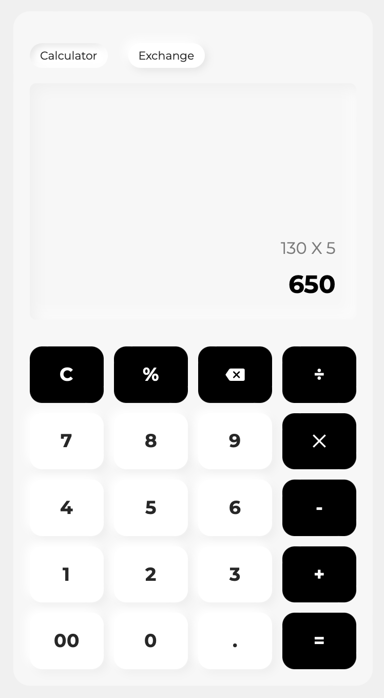

# Neomorphic Calculator

This project inspired by [muhammad Fadli](https://dribbble.com/shots/14734566-Calculator-App) design on [Dribbble](https://dribbble.com/).

## Screenshot

## Dependencies

| Name                   | Version |
| ---------------------- | ------- |
| react                  | 18.1.0  |
| styled components      | 5.3.5   |
| typescript             | 4.4.2   |
| @fontsource/montserrat | 0.61.0  |
| @reduxjs/toolkit       | 1.8.2   |

## Todos

- [x] Add Markup And Style
- [ ] Add Calculate Availabilty
- [ ] Add Calculation History
- [ ] Add Keyboard Support
